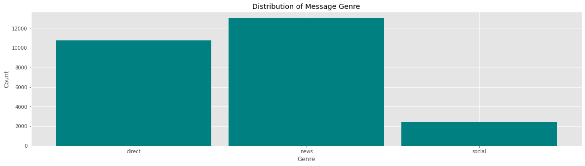
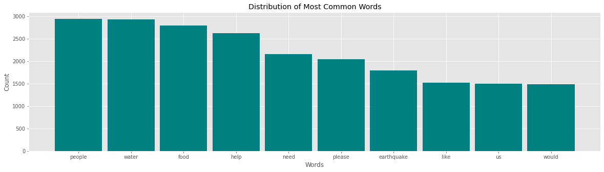
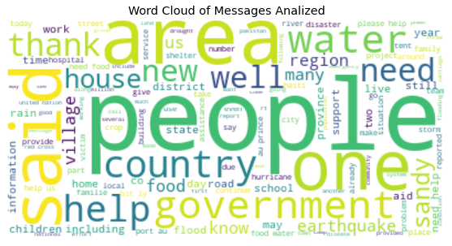

# **Disaster Response Message Analysis Project - Ensemble and RNN methods**
In this notebook I explore three methods to analyze text data to predict the topics of the text. This is done with data from [Figure Eight](https://appen.com), where there are compiled text messages from disaster survivors, and the objective is to classify them to understand the priorities when dealing with the disaster. 

## Documentation
The following project was done as part of the Udacity's Data Science Nano Degree Program, who provided the raw databases. This information was orinated in Figure Eight. 

The text messages inside the table that are analyzed have three genres, and the distribution can be seen below:

Another important thing to notice is that the text analyzed correspond to disasters. Below you can find the top 10 most frequent words among the differente texts:

In this project you will find two parts:

1. Application: in the application section of the project, there is a web application that uses the analyzed information to make graphs and predictions. This predictions are done with a [Random Forest](https://en.wikipedia.org/wiki/Random_forest#:~:text=Random%20forests%20or%20random%20decision,average%20prediction%20(regression)%20of%20the) model, that is trained on the information given by Udacity. The templates for the web app where provided by Udacity. 

2. Notebook: in the notebook you can find also the Random Forest model, and the preprocessing and graphs. It also contains an improved model, which was done using Grid Search to choose between [XGBoost](https://xgboost.readthedocs.io/en/latest/) and the Scikit-Learn Random Forest algorithm. **It also contains a Recurrent Neural Network, which has its own preprocessing process**. The results are shown in the corpus of the notebook. 

## Tools and Software Used
+ [Pandas](https://pandas.pydata.org): v.1.1.3
+ [Numpy](https://numpy.org): v.1.19.2
+ [Matplotlib](https://matplotlib.org): v.0.23.2
+ [Scikit-Learn](https://scikit-learn.org/stable/): v.3.3.2
+ XGBoost
+ wrodcloud
+ [TensorFlow2](tensorflow.org): v.2.4.1
+ re

## License

This software is licensed under the [MIT](https://opensource.org/licenses/MIT) license. The license can be found in the `license.txt` file. 

## Acknoledgements

This package was done under the guidance of [Udacity](udacity.com) Data Science Nano Degree. 

Also, I would like to thank the free online education platforms [Coursera](https://www.coursera.org) and [Edx](https://www.edx.org), which helped me to get started in this path. And in particular both the [Deep Learning](https://www.coursera.org/specializations/deep-learning?skipBrowseRedirect=true) and [TensorFlow 2 for Deep Learning Specialization](https://www.coursera.org/specializations/tensorflow2-deeplearning) programms in Coursera.